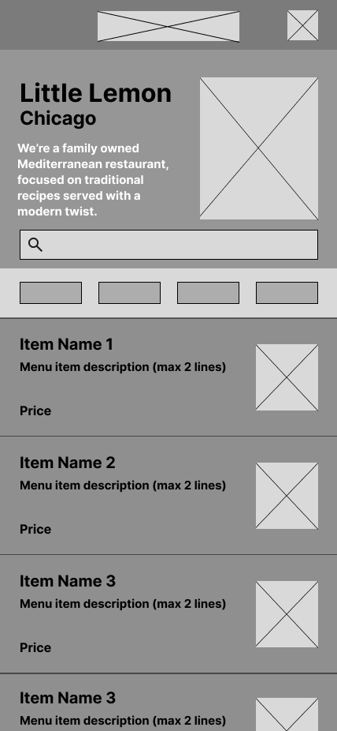
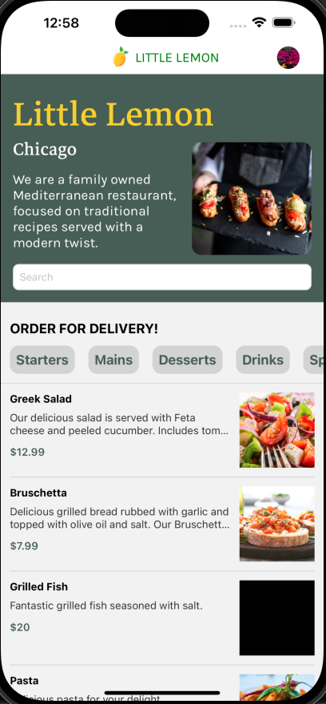
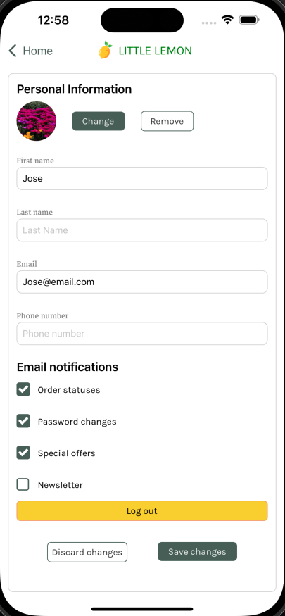
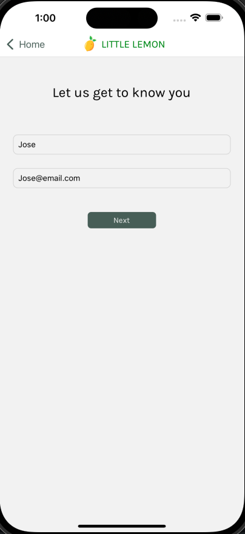

# Final Project - Meta React Native Developer Certificate

## Overview

This project is the culmination of the skills acquired throughout the Meta React Native Developer Certificate on Coursera. It showcases a comprehensive application built using **React Native**, **Expo**, and other modern mobile development technologies. The goal is to create an engaging, user-friendly mobile experience with real-world functionality and performance.

## Features

- **Responsive Design**: Ensures seamless experience on both iOS and Android devices.
- **Navigation**: Smooth and intuitive multi-page navigation with animations.
- **Custom Components**: Reusable components designed to streamline development and maintain a clean codebase.
- **API Integration**: Real-time data fetching and rendering.

## Getting Started

### Prerequisites

To run this project locally, ensure you have the following installed:

- Node.js
- Expo CLI
- React Native CLI

### Installation

1. Clone this repository:
   ```bash
   git clone https://github.com/JOSEJ94/little-lemon-capstone.git
   ```
2. Navigate to the project directory:
   ```bash
   cd litle-lemon-capstone
   ```
3. Install dependencies:

   ```bash
   npm install
   ```

4. Start the Expo server:
   ```bash
   expo start
   ```

### Usage

Open the Expo app on your mobile device and scan the QR code from the Expo server to launch the application.

## Project Structure

- **/assets**: Holds images, fonts, and other static resources.
- **/components**: Reusable components used throughout the app.
- **/app**: Main screens representing different views in the app.

## Future Improvements

- Adding additional authentication options.
- Enhancing performance with lazy loading and optimizations.
- Expanding test coverage for UI and functionality.

## Acknowledgments

Special thanks to Meta and Coursera for this opportunity to learn and grow in mobile development.

## Low Fidelity Wireframe



### Actual Screenshots




